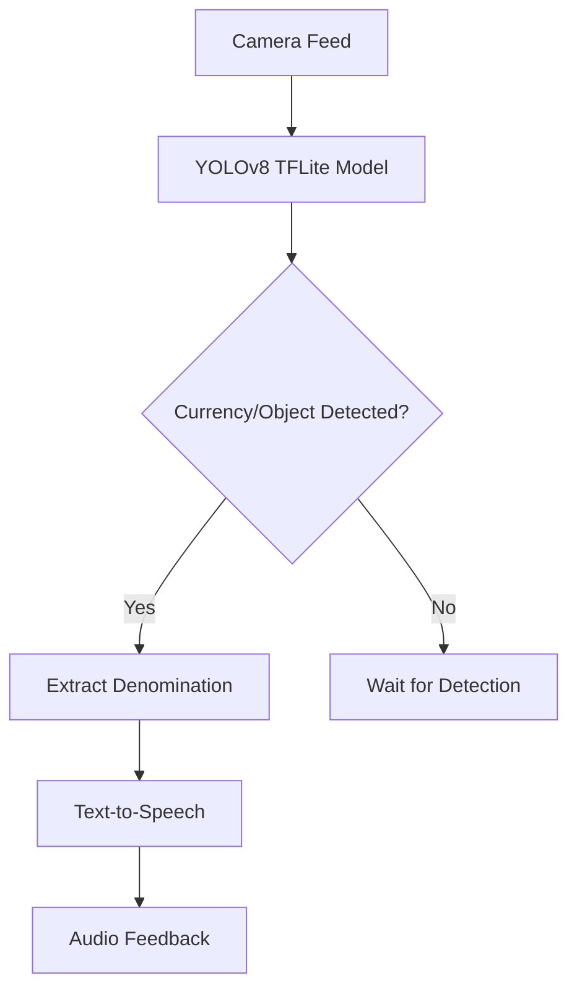
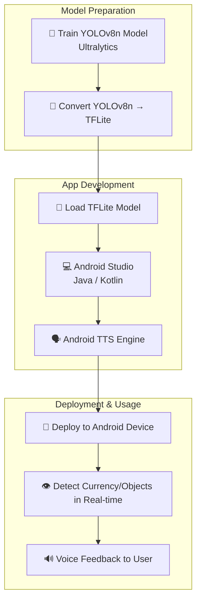

# 👁️ Sightless Navigator

> Empowering visually impaired users with real-time Indian currency recognition using YOLOv8 and TFLite on Android.

---

### 📱 Overview

Sightless Navigator is an Android application designed to assist visually impaired individuals by detecting Indian currency notes in real time   using the device camera. Leveraging **YOLOv8 object detection**, converted to **TFLite**, and **Text-to-Speech (TTS)** capabilities, the app speaks out the denomination of detected notes, enabling independent financial interactions.

---

### 🧠 How It Works



---

### 🔍 Features

- 🔎 Real-time object detection using YOLOv8n.
- 🎙️ Text-to-Speech for voice feedback of detected currency.
- 📲 Lightweight TFLite model optimized for mobile devices.
- 🇮🇳 Focused on Indian currency denominations.
- 🧑‍🦯 Accessibility-first design.

---

### 🧰 Tech Stack

| Component        | Technology                          |
|------------------|-------------------------------------|
| Model Training   | YOLOv8n (Ultralytics)               |
| Conversion       | ONNX → TFLite                       |
| App Development  | Android Studio (Java/Kotlin)        |
| Voice Feedback   | Android TTS Engine                  |
| Deployment       | Android Device                      |

--- 

## 🚀 Project Flow Diagram



---

### 🏁 Getting Started
🔧 Prerequisites

Before you begin, make sure you have the following:

- 📱 **Android Studio** installed
- 🔌 **Android device** with camera & speaker
- 🧠 Basic knowledge of **Java/Kotlin** (helpful but not mandatory)
- 🛠️ **Git** installed
- ⚡ For training YOLOv8n:
  - ✅ **GPU with CUDA** support (recommended), **or**
  - 🐍 Install PyTorch with CPU support:  
    ```bash
    pip install torch torchvision torchaudio --index-url https://download.pytorch.org/whl/cu126
    ```
  - 🧰 Install the ultralytics library
    ```bash
    pip install ultralytics
    ```
- 📂 Dataset

    The custom dataset used for training the YOLOv8n model is available on Google Drive:
  
    - 🔗 [Download Dataset](https://drive.google.com/drive/folders/1vSwiNxIfMKrbS2MCvLdEm8Fhji5rJbNB?usp=sharing)


---

### 🚀 Installation
- Clone the repo:

```bash
git clone https://github.com/yourusername/sightless-navigator.git
cd sightless-navigator
```
- Open in Android Studio.
- Add the TFLite model (currency_model.tflite) to the assets folder.
- Build and run on your Android device.

---

### 🙌 Acknowledgements
- Ultralytics YOLOv8
- TensorFlow Lite
- Android TTS

---

### 👤 Author

- Aditya Patil
- 📧 adityapatil0718@gmail.com
- 🔗 www.linkedin.com/in/aditya-patil-83bab626a
